

# 🚀 G-Tunnel — High-Performance WebSocket Proxy

به **G-Tunnel** خوش آمدید؛ نسل جدید و بهینه‌سازی شده پروکسی‌های مبتنی بر GitHub Codespaces. این پروژه با هدف ارائه اتصالی پایدار، سریع و کاملاً خودکار، بر پایه هسته قدرتمند Xray و پروتکل WebSocket بازطراحی شده است.

---

## 🌟 چرا G-Tunnel؟

در نسخه **G-Tunnel**، ما تمامی موانع فنی را از پیش پای شما برداشته‌ایم. برخلاف نسخه‌های قدیمی که نیاز به ویرایش دستی فایل‌ها و ساخت UUID داشتند، در این پروژه همه‌چیز به صورت داینامیک و در لحظه اجرا (Runtime) انجام می‌شود.

| ویژگی | توضیح |
|---|---|
| **⚡ پینگ پایین** | کاهش از ۱۵۰۰ms به **۱۹۰–۴۰۰ms** با IP‌های اختصاصی |
| **🔗 اتصال پایدار** | پروتکل **WebSocket** برای محیط‌های دارای اختلال |
| **🤖 اتوماسیون ۱۰۰٪** | بدون نیاز به ویرایش دستی `config.json` |
| **🛡️ UUID یکتا** | هر بار اجرا یک UUID جدید — امنیت بیشتر |
| **📡 چند IP** | ۷ آدرس مستقیم + دامنه GitHub برای انتخاب بهترین پینگ |

---

## 🛠️ راهنمای نصب و اجرای سریع

برای راه‌اندازی **G-Tunnel** تنها کافیست مراحل زیر را دنبال کنید:

**۱. Fork کردن پروژه**
> در بالای صفحه روی گزینه **Fork** کلیک کنید تا یک نسخه از پروژه در حساب شما کپی شود.

**۲. ساخت Codespace**
> - وارد ریپوی فورک شده خود شوید
> - روی دکمه سبز **`<> Code`** کلیک کنید
> - در تب **Codespaces** گزینه **Create codespace on main** را انتخاب کنید

**۳. دریافت کانفیگ**
> - منتظر بمانید تا محیط اجرا آماده شود (حدود ۳ دقیقه)
> - به محض اتمام نصب، تمام لینک‌های **VLESS** به صورت خودکار در Terminal نمایش داده می‌شوند

---

## ⚙️ تنظیمات حیاتی برای عملکرد پایدار

### ۱. 🕐 تنظیم Idle Timeout

به [github.com/settings/codespaces](https://github.com/settings/codespaces) بروید:

- بخش **Default idle timeout** را پیدا کنید
- مقدار را به **`240`** دقیقه تغییر دهید و **Save** کنید

### ۲. 🌍 انتخاب Region

در همان صفحه تنظیمات، در بخش **Region**:

- گزینه **Set manually** را انتخاب کنید
- نزدیک‌ترین لوکیشن به ایران (مناطق اروپایی) را انتخاب کنید

---

## 📈 ظرفیت و محدودیت‌های زمانی

| نوع اکانت | سهمیه ماهانه |
|---|---|
| 👤 **اکانت عادی** | ۶۰ ساعت در ماه |
| 🎓 **اکانت دانشجویی** | ۹۰ ساعت در ماه |

> 💡 **نکته حرفه‌ای:** وقتی از پروکسی استفاده نمی‌کنید، از [پنل مدیریت](https://github.com/codespaces) سرور را **Stop** کنید تا سهمیه بیهوده مصرف نشود.

---

## 📱 نرم‌افزارهای پیشنهادی

| پلتفرم | نرم‌افزار |
|---|---|
| 🤖 **Android** | v2rayNG, Nekobox |
| 🪟 **Windows** | v2rayN, Nekoray |
| 🍎 **iOS** | V2Box, Streisand, FoXray |

---

## ⭐ حمایت از G-Tunnel

اگر این پروژه به شما کمک کرد، با یک **Star ⭐** در بالای صفحه ما را دلگرم کنید.

**🪙 حمایت مالی (Crypto Donates):**

| شبکه | آدرس |
|---|---|
| 💛 **USDT (BEP20)** | `0xec6b356e1b458564de16d01108cc391d8792a92a` |
| 🟢 **USDT (TRC20)** | `TSGuHweHCv1Y348Kwyvz5ANGdGNUykgx3c` |
| 💎 **TON** | `UQACY3kYWw28tsKV6PcXZrvneFfGGfMBnmeeM1wlopC1RNVh` |

---

*توسعه داده شده با ❤️ برای آزادی دسترسی به اطلاعات*

